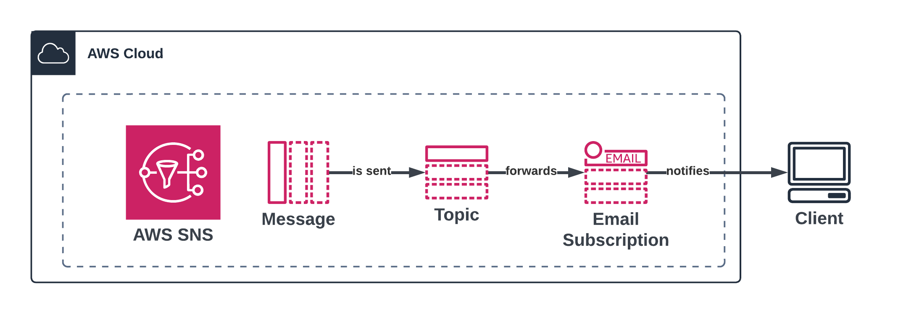

# Project-01: AWS SNS Notification System



## Overview
This Terraform project creates an AWS SNS topic with email subscription and automated message publishing capabilities. The project uses a shared configuration module to apply consistent tags across resources.

## Resources Created
- **SNS Topic**: Named `{product}-sns-{environment}` (e.g., `tf-sns-dev`)
- **SNS Email Subscription**: Sends notifications to configured email
- **Null Resource**: Uses local-exec provisioner to publish messages via AWS CLI

## Prerequisites
- Terraform >= 1.2
- AWS Provider 6.21.0
- Null Provider 3.2.4
- AWS CLI configured with appropriate credentials

## Configuration Variables

| Variable | Description | Default |
|----------|-------------|---------|
| `aws_region` | The AWS region to deploy resources in | `eu-central-1` |
| `sns_email_endpoint` | The email endpoint to subscribe to the SNS topic | `rishi.cv40@gmail.com` |
| `email_message` | The message to send via SNS email | `Welcome to the first SNS topic deployment using Terraform!` |

## Usage

```bash
# Initialize Terraform
terraform init

# Plan deployment
terraform plan

# Apply configuration
terraform apply

# Destroy resources
terraform destroy
```

## Email Subscription
The SNS topic is configured to send notifications to `rishi.cv40@gmail.com` (configurable via `sns_email_endpoint` variable). You must confirm the subscription via the email confirmation link sent by AWS.

## Resource Tags
The project uses a shared configuration module (`../../modules`) that applies consistent tags to all resources:
- **Name**: `{product}-sns-{environment}`
- **Environment**: Loaded from config (default: `dev`)
- **Product**: Loaded from config (default: `tf`)
- **CreatedBy**: Loaded from config (default: `terraform`)
- **Deployment**: Loaded from config (default: `automation`)

## Outputs

| Output | Description |
|--------|-------------|
| `aws_sns_topic_arn` | The ARN of the SNS topic created for email delivery |

## Notes
- The null resource provisioner publishes a message to the SNS topic after the email subscription is created
- Messages are published using the AWS CLI via local-exec provisioner
- The topic naming follows the pattern from the shared configuration module
- Ensure AWS CLI is properly configured before running `terraform apply`
